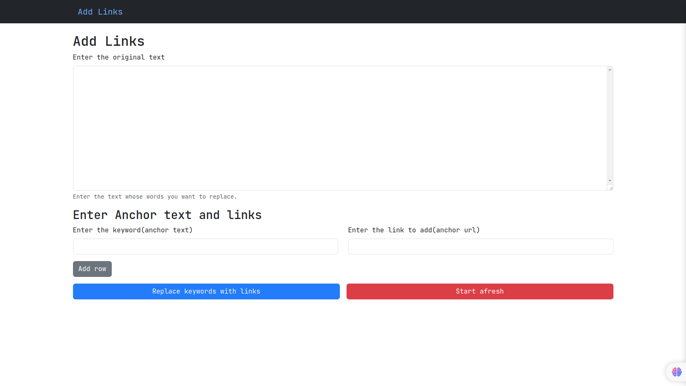

# Add Links

Say you have a piece of text and want to add links to specific words. You could use a word editor to do that, but then you would have to find each word and add a link to it. What happens if you want to add different links to different words?

With this simple tool, you only need to _enter the word and the associated link, and it replaces every instance of that word with a hyperlink._ **You can add as many keyword-link pairings as you like, see the final result, and copy the raw HTML at the end.** You also get a chance to edit the final HTML and see the final result before copying the raw HTML.

This tool supports local host storage. This means you can **go back and even reload the main page and the initial text and first link you added will be available.** This means you can go back and not have to past in the original text and first link.

You can see this tool in action on the video added above. You can also clone it from GitHub here and use it however you like. Feature additions and suggestions are always welcome because I know this is not finished, but it does what I need it to right now.
